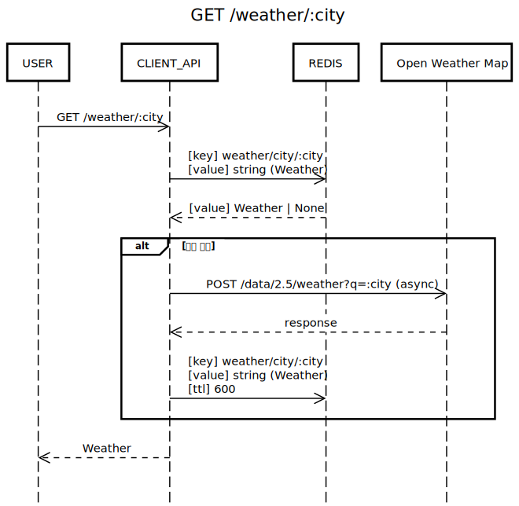
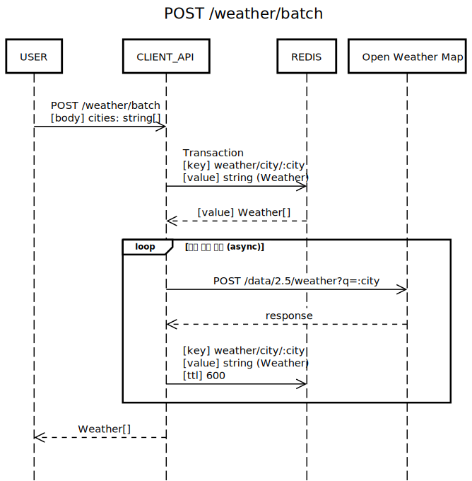

# API

## Weather

### GET /weather/:city

1. 도시 날씨 조회 요청
2. Redis에 캐시된 날씨 확인
3. 캐시된 날씨가 없다면 OpenWeatherMap에서 날씨 조회
4. 600초간 캐시하도록 redis에 저장
5. 날씨 응답

### POST /weather/batch

1. 여러 도시 날씨 조회 요청
2. Redis에 캐시된 날씨 확인, 하나의 transaction으로 묶어서 조회
3. 캐시되지 않은 도시의 날씨를 비동기로 조회. 조회 도중 일부 요청이 실패하더라도, 정상적으로 조회된 결과는 즉시 redis에 저장하여 재사용 가능하도록 구현
4. 날씨 리스트 응답