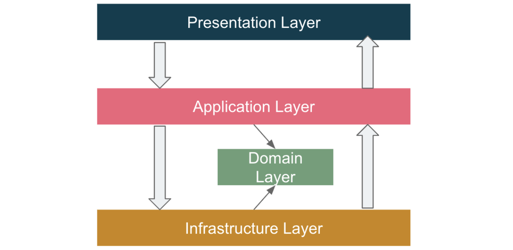

# Architecture & Structure

## Architecture

이 프로젝트는 Domain Driven Design(DDD), Hexagonal Architecture, Layered Architecture, Command Query Responsibility
Segregation(CQRS)를 적절히 적용하여
구성하였으며, 향후 프로젝트가 상용 애플리케이션 수준으로 확장되어 `admin_api`와 같은 새로운 애플리케이션이 추가되는 상황을 가정하고 설계하였습니다.

개인적인 경험으로는 아키텍처를 이론 중심으로 접근할 경우, 사용하는 프로그래밍 언어와 프레임워크의 특성이 충분히 고려되지 못할 수 있으며, 그 결과 오버엔지니어링으로 이어져 코드의 복잡도와 개발 시간이 불필요하게
증가할 수 있다고 생각합니다.

이러한 이유로 저는 프로젝트의 규모와 방향성에 맞춰 적절한 수준의 구조를 선택하고, 아키텍처의 설계 의도와 개발 규칙을 명확하고 보기 쉽게 문서화하여 팀이 이를 공통된 기준으로 개발하는 것이 유지보수성과 개발 속도
측면에서 효과적이라고 생각합니다.

## Structure

```
root/
├── .data/                  # container volume mount 저장용 폴더
├── .docs/                  # 프로젝트 소개 문서
├── .infra/                 # 로컬환경 인프라 구축에 필요한 설정파일
├── client_api/             # Presentation Layer + Application Layer
│   ├── main.py             
│   ├── settings.py         # 전체 환경변수, 설정값 관리
│   ├── dependency.py       # 전체 Dependency Injection 관리
│   ├── router/             # Controller
│   │   └── weather/        
│   │       ├── router.py   
│   │       ├── request.py  
│   │       └── response.py 
│   └── shared/              
│       ├── config/         # 설정파일
│       ├── dto/            # 공통 DTO
│       └── middleware/     # 미들웨어 
│
├── domain/                 # Domain Layer 
│   └── weather/            
│       ├── service.py      
│       ├── provider.py     # interface
│       ├── repository.py   # interface
│       └── data/           
│           ├── model.py    # 도메인 모델
│           └── query.py    # Query
│
└── infrastructure/         # Infrastructure Layer
    ├── openweather/        # 외부 API 
    │   ├── client.py       
    │   ├── provider.py   
    │   ├── model.py       
    │   ├── error.py        
    │   └── settings.py     
    └── redis/              # Persistance
        ├── redis_manager.py           
        ├── weather_cache_repository.py 
        └── settings.py               
```

### 1. Client API (`client_api/`)

일반적으로 layered architecture 기반의 도메인 주도 설계에서는 일반적으로 presentation, application, domain, infrastructure 로 구분하고,
Application에서 도메인과 외부 클라이언트 데이터를 조합하여 처리하고, presentation에서 API의 request/response를 관리합니다.

이번 프로젝트에서는 presentation, application 계층 분리로 얻는 가독성, 명확한 역할 분리 같은 이점 보다는 계층간 통신을 위해 만들어지는 모듈, DTO로 인한 코드 복잡도로 인한 단점이 크다고
판단하여 두 계층을 통합하는 방향으로 설계했습니다.


#### 컴포넌트

- `main.py`: 애플리케이션 시작
- `router/`: API 엔드포인트 정의 및 요청/응답 처리
- `dependency.py`: 전체 애플리케이션 의존성 주입 설정
- `shared/middleware/`: 공통 미들웨어

### 2. Domain (`domain/`)

1. 도메인 별로 모듈을 분리하고 관련된 서비스, 모델, 엔티티 등을 하나의 폴더에서 관리함으로서 도메인에 집중하고 추후에 분리가 쉽도록 구현했습니다.
2. `provider.py`, `repository.py`에는 어댑터 패턴을 적용하여 도메인에서는 직접적인 구현체는 모르도록 구현했습니다.
3. Dto와 repository 이름에 `command`, `query`를 포함하도록하여 각각의 용도를 명확히 하도록 하였습니다. 단, 데이터베이스를 분리하지는 않습니다.

#### 컴포넌트

- `service.py`: 비즈니스 로직 구현
- `provider.py`: 외부 API 인터페이스 (어댑터 패턴)
- `repository.py`: 데이터베이스 인터페이스 (어댑터 패턴), Command와 Query
- `data/model.py`: 도메인 모델
- `data/entity.py`: 데이터베이스 엔티티 (ORM)
- `data/query.py`: 조회 객체
- `data/command.py`: 저장, 업데이트, 삭제 객체

### 3. Infrastructure (`infrastructure/`)

데이터베이스, 외부 서비스들을 모듈로 나누고 도메인에서 정의한 인터페이스의 구현체, 설정, client 등을 정의합니다.

#### 컴포넌트: 외부 서비스

- `client.py`:
    - Client 설정
    - Retry 로직
    - 로깅
- `provider.py`: 도메인 인터페이스 구현
- `model.py`: 외부 서비스의 request, response 값 정의
- `error.py`: 커스텀 에러

#### 컴포넌트: Persistence

- `repository.py`: 도메인 repository 인터페이스 구현
